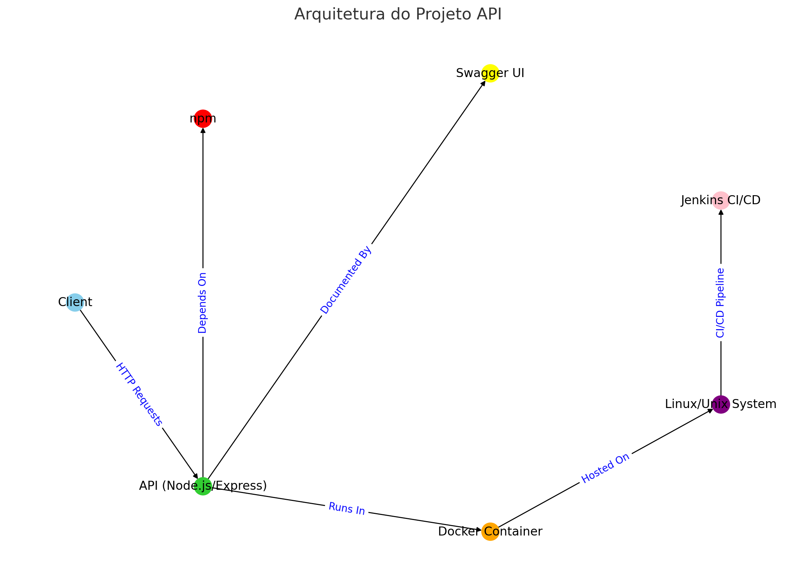

# Projeto API - Análise de Tecnologias e Funcionalidades

## Tecnologias Utilizadas

1. **Node.js e Express**: O arquivo `api.js` faz uso de `express`, que é um framework web para Node.js. Isso sugere que o back-end é escrito em JavaScript e usa o framework Express para lidar com rotas e lógica da API.

2. **Docker**: O `Dockerfile` sugere que o projeto usa contêineres Docker para isolamento de ambiente e implantação. A imagem base usada é o Node.js versão 14.

3. **Shell Script**: O arquivo `install.sh` é um script shell que provavelmente automatiza a instalação e configuração do projeto, especialmente em ambientes Linux/Unix.

4. **Jenkins**: O `Jenkinsfile` indica que o projeto usa Jenkins para Integração Contínua e Entrega Contínua (CI/CD).

5. **NPM**: `package.json` e `package-lock.json` indicam que o projeto usa o gerenciador de pacotes npm, reforçando que este é um projeto Node.js.

6. **Swagger**: O arquivo `swagger.json` sugere que o projeto usa Swagger para documentação da API, seguindo a especificação OpenAPI.

7. **Outras Bibliotecas**: Além do Express, o projeto também usa as bibliotecas `json-serializer` e `mathjs`, conforme indicado em `package.json`.

# API.js - Trecho de Código

## Visão Geral

O arquivo `api.js` é o ponto principal de entrada para a API, construída usando Node.js e o framework Express. Ele configura o servidor, define rotas e importa outros módulos necessários.

## Tecnologias

- **Node.js**: O ambiente de execução para JavaScript no lado do servidor.
- **Express**: Um framework web rápido e não opinativo para Node.js.

## Dependências

- `express`: Para configurar o servidor web e definir rotas.
- `swaggerUi`: Para integrar a documentação da API baseada em Swagger.
- `json-serializer`: Provavelmente usado para serializar dados para o formato JSON.
- `mathjs`: Uma biblioteca para cálculos matemáticos avançados.

## Endpoints da API

A API, conforme definido no arquivo `swagger.json`, possui os seguintes endpoints:

- `/api/convert_days/{days}`
- `/api/potencia/{num1}/{num2}`
- `/api/raiz_quadrada/{num}`
- `/api/calcular_salario/{funcionario}/{hora}/{salario}`
- `/api/primo/{number}`
- `/api/bhaskara/{a}/{b}/{c}`

## Endpoints Personalizados e Swagger

Além dos endpoints definidos pelo Swagger, os seguintes endpoints personalizados estão disponíveis:

- Swagger: `/api-docs`
- GET: `/api/convert_days/{days}` - Converte dias em anos, meses e dias
- GET: `/api/potencia/{num1}/{num2}` - Calcula a potência dos números
- GET: `/api/raiz_quadrada/{num}` - Calcula a raiz quadrada de um número
- GET: `/api/calcular_salario/{funcionario}/{hora}/{salario}` - Calcula o salário do funcionário
- GET: `/api/primo/{number}` - Verifica se um número é primo
- GET: `/api/bhaskara/{a}/{b}/{c}` - Calcula a fórmula de Bhaskara

# Arquitetura

